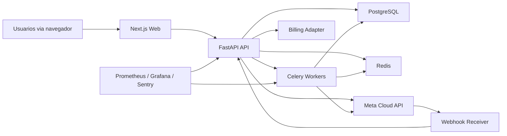

# ETAPA 1 - Arquitetura SaaS Web

## Objetivo do produto

Construir uma plataforma web SaaS multiempresa e multiloja para atendimento e CRM via WhatsApp Business Platform, com:

- acesso via navegador
- painel central do superadmin
- operacao por empresa e por loja
- billing recorrente
- observabilidade por loja
- acao de reinicio individual por loja sem perda de dados

## Stack escolhida

### Backend

- FastAPI
- SQLAlchemy 2.x
- PostgreSQL
- Redis
- Celery para filas assicronas
- OpenTelemetry para traces

### Frontend

- Next.js com App Router
- React
- TypeScript

### Observabilidade e operacao

- Prometheus
- Grafana
- Sentry
- logs estruturados em JSON

### Infra

- Docker para desenvolvimento
- Kubernetes para producao
- Nginx Ingress ou reverse proxy gerenciado

## Por que essa stack

### FastAPI

- alta produtividade para API de controle
- tipagem forte
- excelente integracao com async para webhooks e chamadas externas

### Next.js

- melhor experiencia web para SaaS administrativo
- roteamento, layouts, server actions e protecao de paginas
- facilita paines separados para superadmin, empresa e loja

### PostgreSQL

- melhor encaixe para relacional, billing, auditoria e CRM
- Row Level Security ajuda na protecao multi-tenant
- suporta particionamento para mensagens e eventos

### Redis + Celery

- desacopla webhooks, envio de mensagens, billing events e automacoes
- permite inspecao operacional e retentativa controlada

### Kubernetes

- melhor opcao para isolar componentes de runtime
- facilita rolling updates, health checks e reinicios seletivos

## Arquitetura logica

## Multi-tenancy escolhida

Escolha: **modelo hibrido control-plane + dados compartilhados com RLS**

### Como fica

- schema `public`:
  - usuarios da plataforma
  - configuracao global
  - billing
  - auditoria global
  - tenants, empresas, lojas
- schema `crm`:
  - contatos
  - conversas
  - mensagens
  - eventos
  - templates
  - canais WhatsApp
- toda tabela operacional tem `company_id`
- tabelas ligadas a operacao diaria tambem tem `store_id`
- protecao por PostgreSQL Row Level Security + filtros obrigatorios no backend

### Justificativa

- mais simples de operar do que schema por tenant
- melhor para relatorios consolidados do superadmin
- melhor para observabilidade global
- mais facil para faturamento por empresa, por loja e por recurso
- menos complexidade em migrations e analytics

### Medidas de isolamento

- `company_id` obrigatorio em entidades tenant-aware
- `store_id` obrigatorio em entidades operacionais
- RLS por `company_id` e listas autorizadas de `store_id`
- filtros de escopo no backend e no frontend
- acoes criticas exigem validacao extra de escopo

## Billing escolhido

### Arquitetura

Billing como modulo separado no backend, com adaptador de gateway:

- `BillingProviderAdapter`
- `AsaasAdapter` como implementacao principal
- `PagarmeAdapter` como alternativa futura

### Recomendacao principal

**Asaas** como gateway inicial para o mercado brasileiro.

Motivos:

- documenta subscriptions e cobrancas recorrentes
- suporta cartao, boleto e Pix
- tem webhooks oficiais
- e comum em SaaS brasileiro
- permite trial e regras de vencimento com boa aderencia

Observacao real:

- a documentacao atual da Asaas indica `Automatic Pix` como funcionalidade sob acesso controlado
- recorrencia por cartao e boleto e o baseline mais previsivel
- Pix recorrente pode entrar por recurso habilitado na conta

Referencia:

- [Asaas Subscriptions](https://docs.asaas.com/docs/subscriptions)
- [Asaas Subscription Overview](https://docs.asaas.com/docs/subscription-overview)
- [Asaas Automatic Pix](https://docs.asaas.com/docs/automatic-pix)
- [Asaas Recurring Pix](https://docs.asaas.com/docs/recurring-pix)

### Regras de negocio de billing

- plano por empresa
- addons por loja
- addons por numero WhatsApp
- addons por usuario
- limites de uso opcionais por conversa ou evento
- periodo de trial opcional
- dunning configuravel
- suspensao parcial ou total

## Meta oficial

A integracao deve usar apenas:

- WhatsApp Business Platform / Cloud API
- webhooks oficiais
- templates oficiais
- tokens e credenciais oficiais

Limitacoes reais:

- mensagens fora da janela de 24 horas exigem template aprovado
- recebimento em tempo real depende de webhook publico HTTPS
- templates dependem de aprovacao da Meta
- metricas internas de atendimento serao calculadas pela plataforma a partir dos eventos armazenados; nao devem ser confundidas com analytics oficiais da Meta

Referencias:

- [WhatsApp Cloud API Overview](https://developers.facebook.com/docs/whatsapp/cloud-api/overview)
- [WhatsApp Cloud API Get Started](https://developers.facebook.com/docs/whatsapp/cloud-api/get-started)
- [Graph API Webhooks](https://developers.facebook.com/docs/graph-api/webhooks/getting-started)
- [Message Templates](https://developers.facebook.com/docs/whatsapp/cloud-api/guides/send-message-templates)

## Status por loja

Cada loja tera uma visao agregada de saude calculada a partir de:

- heartbeat do runtime da loja
- status dos canais WhatsApp
- backlog de fila
- falhas recentes de webhook
- falhas recentes de envio
- status das automacoes
- ultima atividade valida
- versao do runtime logico da loja

O status sera materializado em uma tabela de leitura rapida e tambem emitido como metrica.

## Reinicio individual por loja

Nao vamos usar um container por loja como modelo padrao. Isso encarece operacao e complica escala.

A decisao e:

- API central compartilhada
- workers compartilhados
- **runtime logico por loja**

Cada loja tera:

- `store_runtime_state`
- `runtime_generation`
- locks distribuidos por loja no Redis
- jobs idempotentes vinculados a `store_id`

Quando o superadmin reiniciar uma loja:

1. cria `restart_event`
2. registra motivo, autor e horario
3. incrementa `runtime_generation`
4. invalida leases e locks daquele `store_id`
5. reencaminha somente jobs daquela loja
6. marca status como `restarting`
7. o worker reassume a loja com a nova geracao

Isso reinicia a operacao daquela loja sem tocar nos dados persistidos.

## Limitacoes reais

- reinicio por loja depende de jobs idempotentes e controle de geracao
- se existir integracao externa travada fora da plataforma, o restart logico nao substitui correcao de credenciais
- webhook da Meta continua global ao app, mas o roteamento interno sera por canal e loja
